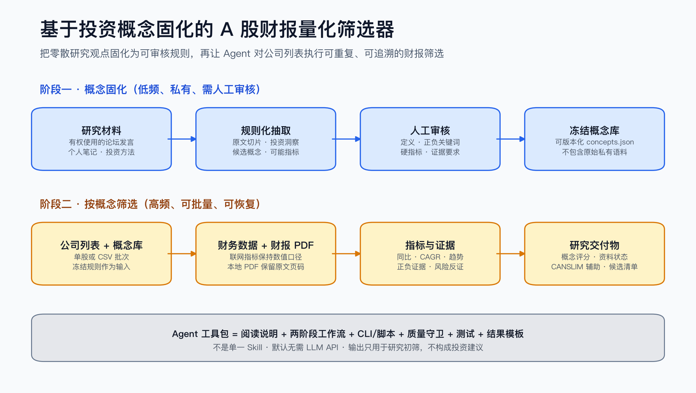
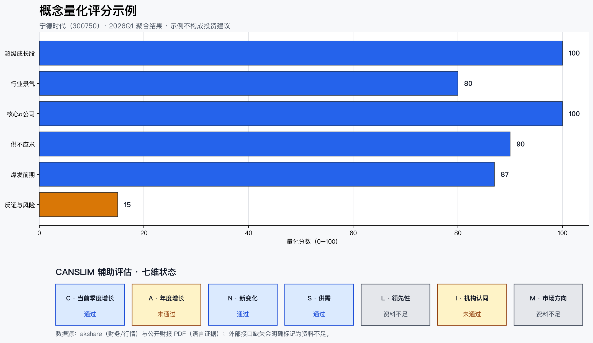

# 基于投资概念固化的 A 股财报量化筛选器

一个面向 AI Agent 和个人研究者的开源工具包：把用户有权使用的论坛发言、研究笔记或投资方法整理成可审核、可版本化的投资概念库，再按固定概念自动抽取 A 股财务指标与财报原文证据，完成量化评分、风险提示和研究候选排序。CANSLIM 是内置辅助评估框架之一，不是项目的唯一身份。

> [!CAUTION]
> 本项目只用于研究、学习和信息初筛，不构成投资建议、收益承诺或买卖依据。任何自动评分都可能错误、过时或不完整。请阅读 [完整免责声明](DISCLAIMER.md)。



这不是一个单独的 Skill，而是一套可由 Agent 阅读和调用的工具包，包含使用说明、两阶段工作流、确定性 Python 工具、自动化脚本、质量守卫、测试和结果模板。用户可以向 Agent 提供公司列表和本地项目位置，让 Agent 按 [AGENT_GUIDE.md](AGENT_GUIDE.md) 自动运行并汇总结果。



图中为脱敏后的聚合示例。示例公司、分数和指标不代表推荐；行情接口缺失会明确显示为“资料不足”。

## 项目解决什么问题

很多个人投资者拥有大量零散的论坛收藏、研究笔记和选股观点，但难以把这些内容转成稳定、可重复、可审计的筛选规则。人工逐家公司下载财报、核对指标、寻找原文和整理表格也非常耗时。

本工具把这项工作拆成两段：先把研究观点固化成“概念—关键词—指标—证据要求—评分规则”，再让 Agent 对公司列表重复执行同一套财报筛选流程。这样既保留研究者自己的方法，也减少重复阅读、复制和提示词消耗。

## 主要特点

- **两阶段工作流**：先将用户自己的研究笔记整理并冻结成概念库，再反复按固定概念筛选公司。概念提炼和公司分析互不耦合。
- **默认不调用 LLM**：核心流程采用确定性规则、公开接口和本地解析，不需要 API Token，也不会在每只股票上重复消耗模型 Token。
- **数字与原文分离**：财务数字来自 akshare；PDF 只负责原文证据，不从排版复杂的 PDF 表格中猜测关键财务值。
- **面向 A 股**：支持六位 A 股代码、公开定期报告、沪深 300 市场方向和批量股票清单。
- **可审计输出**：每条证据保留 PDF 文件、相对路径和页码；每项评分保留指标、期间、原值和原因。
- **CANSLIM 辅助模块**：内置欧奈尔 CANSLIM 七维的工程化近似，但概念库和评分框架可以独立扩展。
- **Agent 友好**：提供稳定 CLI、阶段清单、机器可读清单和结果模板，适合让 Codex 等 Agent 自动执行。
- **失败不会伪装成功**：无财务指标或无可读 PDF 时主管线失败；外部行情缺失时辅助模块明确标记为“资料不足”。
- **可恢复批处理**：单家公司失败不影响其他公司；`--resume` 可以跳过已成功公司。

## 两阶段工作方式

```text
阶段一（低频、私有）
用户研究笔记 → 原文切片 → 规则化洞察 → 概念草稿 → 人工审核 → 冻结概念库
                                                      │
                                                      ▼
阶段二（高频、可重复）
冻结概念库 + A股代码 → 财报/指标 → 趋势与证据 → 概念评分/风险 → CANSLIM辅助 → 交付物
```

阶段一的原始笔记和中间文件应始终保留在本地；固定概念库只保存概念定义、关键词、指标要求和评分规则。详细说明见 [两阶段工作流](docs/WORKFLOWS.md)。

## 快速开始

需要 Python 3.11 或更高版本。

```bash
git clone <你的仓库地址>
cd <仓库目录>
python -m venv .venv
source .venv/bin/activate
pip install -e '.[dev]'
python -m pytest -q
```

安装后使用 `concept-screener`。旧名称 `canslim-screener` 和模块入口 `python -m ds_finance_concept.cli` 作为兼容方式保留。

### 直接使用内置冻结概念库筛选一家公司

```bash
concept-screener screen-company \
  --company-code 300750 \
  --concepts-file config/concepts.json \
  --output-dir outputs/300750
```

省略 `--pdf-dir` 时，系统自动下载公开定期报告。使用本地报告：

```bash
concept-screener screen-company \
  --company-code 300750 \
  --pdf-dir /path/to/financial-reports \
  --concepts-file config/concepts.json \
  --output-dir outputs/300750
```

### 批量筛选

复制并编辑 [examples/companies.csv](examples/companies.csv)，然后运行：

```bash
concept-screener screen-batch \
  --companies-file examples/companies.csv \
  --concepts-file config/concepts.json \
  --output-dir outputs/batch-demo \
  --resume
```

### 用自己的笔记建立概念库

公开仓库仅提供完全合成的 [示例笔记](examples/concept_notes/example.md)。不要提交真实私有笔记。

```bash
concept-screener prepare-concepts \
  --input-dir /path/to/private-notes \
  --workspace-dir concept_workspace/my-research
```

审核 `04_concepts.draft.json`，确认每个概念的 `manual_review.status` 后再冻结：

```bash
concept-screener validate-concepts \
  --concepts-json concept_workspace/my-research/04_concepts.draft.json \
  --output-report concept_workspace/my-research/validation.md

concept-screener freeze-concepts \
  --concepts-json concept_workspace/my-research/04_concepts.draft.json \
  --output-json config/my-concepts.json \
  --output-yaml concept_workspace/my-research/my-concepts.yaml
```

## 输出内容

成功运行后，最终交付物位于 `<output-dir>/deliverables/`：

| 类别 | 主要文件 | 用途 |
| --- | --- | --- |
| 指标 | `01_concept_metrics.csv` | 概念所需核心指标的最新值、同比和趋势 |
| 序列 | `01_metric_series.csv` | 完整财务指标时间序列 |
| 图表 | `01_charts/*.png` | 各指标历史趋势 |
| 证据 | `02_evidence_sentences.csv` | 带 PDF 文件和页码的关键原文句 |
| 证据汇总 | `02_evidence_concept_counts.csv` | 每个概念的正负证据数量 |
| 概念评分 | `03_final_scores.csv` | 分数、资料状态、覆盖率和原因 |
| 辅助框架 | `03_canslim_assessment.csv` | CANSLIM C/A/N/S/L/I/M 七维状态 |
| 报告 | `03_final_report.md` | 适合人工复核的最终报告 |
| 机器结果 | `03_final_assessment.json` | 整体资料状态和机器可读摘要 |

### 展示用聚合结果

以下数据只用于展示输出格式，完整 CSV 位于 [examples/showcase](examples/showcase)：

| 指标 | 期间 | 示例值 | 变化 |
| --- | --- | ---: | ---: |
| 营业总收入 | 2026Q1 | 1,291.31 亿元 | 同比 +52.45% |
| 归母净利润 | 2026Q1 | 207.38 亿元 | 同比 +48.52% |
| 扣非净利润 | 2026Q1 | 180.93 亿元 | 同比 +52.95% |
| 毛利率 | 2026Q1 | 24.82% | 同比 +0.41 个百分点 |
| 研发费用率 | 2026Q1 | 4.12% | 同比 -1.57 个百分点 |
| 合同负债 | 2026Q1 | 455.50 亿元 | 同比 +22.81% |

展示图可以重新生成：

```bash
MPLCONFIGDIR=/tmp/mplconfig python scripts/build_workflow_overview.py
MPLCONFIGDIR=/tmp/mplconfig python scripts/build_showcase.py
```

## 内置 CANSLIM 辅助框架

| 维度 | 当前实现 |
| --- | --- |
| C | 最新季度营收与归母净利润同比 |
| A | 年报营收与归母净利润三年 CAGR |
| N | 固定概念库中的“新变化”财报语言证据 |
| S | 合同负债或在建工程的供需变化 |
| L | 个股相对沪深 300 的六个月强弱 |
| I | 最近报告期的机构持仓记录 |
| M | 沪深 300 是否位于 50 日与 200 日均线之上 |

这是工程化的 CANSLIM 初筛近似，并不等同于 William J. O'Neil 的完整主观研究流程，也不会替代“概念固化—财报证据—量化评分”主流程。

## 重要限制和风险

- akshare 和其上游公开接口可能限流、改版、返回空数据或暂时不可用。
- 不同行业的会计科目含义不同；银行、保险、券商等金融企业不适合直接套用制造业指标。
- 财务数据可能因追溯调整、币种、单位和报告口径变化而不可直接比较。
- PDF 关键词命中不等于事实成立；模板文字、风险章节和否定句都可能产生误判。
- “高分”只表示满足当前规则，不表示估值合理、股价会上涨或风险较低。
- 历史结果不能推断未来表现；系统没有回测交易成本、滑点、停牌和流动性约束。
- 行情或机构接口缺失时，CANSLIM 辅助结果可能为“资料不足”。这不是买入或卖出信号。
- 用户应核对公告原文、交易所披露、审计意见、会计政策和最新市场信息。

## 选股警示

不要完全相信系统。建议把结果当作“待人工调查清单”，至少完成以下复核：

1. 打开证据所指向的财报页，确认语义、主体、期间和否定关系。
2. 在交易所公告中核对最新财务数据和更正公告。
3. 检查行业周期、估值、治理、质押、诉讼、减持和退市风险。
4. 确认数据截止期没有早于当前投资判断时间。
5. 独立决定仓位和风险承受能力；不要依据单个分数交易。

## 项目目录

```text
.
├── config/                 # 可公开的冻结概念库
├── docs/                   # 工作流、目录说明和 README 图片
├── examples/               # 合成笔记、示例股票清单、聚合展示数据
├── scripts/                # 可复现展示素材与维护脚本
├── src/ds_finance_concept/ # 核心 Python 包（名称为兼容旧版本保留）
├── tests/                  # 单元、集成和数据质量测试
├── AGENT_GUIDE.md          # Agent 自动执行说明和提示模板
├── DISCLAIMER.md           # 投资与数据免责声明
├── LICENSE                 # MIT License
├── SECURITY.md             # 安全与凭证处理政策
└── pyproject.toml          # 安装、依赖和命令入口
```

详见 [项目结构说明](docs/PROJECT_STRUCTURE.md)。

GitHub 仓库名称、Topics、About 描述和首次 Release 建议见 [GitHub 发布建议](docs/GITHUB_RELEASE.md)。

## 隐私与安全

- `.gitignore` 默认排除原始财报、私有笔记、工作区、输出、数据库、凭证、Cookie、自选股和缓存行情。
- 本项目不需要行情 API Key；若你自行添加其他数据源，请只通过环境变量或本地密钥管理器提供凭证。
- 提交前运行测试并检查 `git status`。已经提交过的密钥不能只靠删除文件解决，必须立即吊销并清理 Git 历史。
- 可以运行 `python scripts/check_public_repo.py` 检查常见私有目录、凭证格式和异常大文件。
- 安全问题处理方式见 [SECURITY.md](SECURITY.md)。

## 开发与贡献

```bash
pip install -e '.[dev]'
python -m pytest -q
```

贡献规范见 [CONTRIBUTING.md](CONTRIBUTING.md)。提交代码即表示你有权按照 MIT License 提供该内容，且没有夹带受版权或保密协议限制的语料、财报副本或凭证。

## 许可证

代码以 [MIT License](LICENSE) 开源。数据、财报、商标和第三方接口仍受各自权利人条款约束；MIT License 不会授予这些第三方内容的再分发权。
